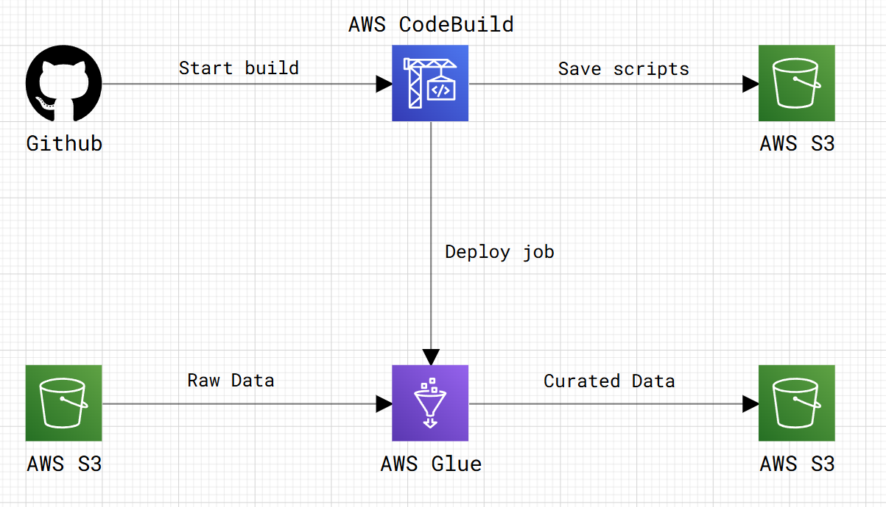

# ETL Pipeline for Flight Data using AWS Glue, AWS CodeBuild and S3

## Overview
This repository contains an ETL (Extract, Transform, Load) pipeline for processing flight data using AWS Glue and S3. The pipeline reads raw flight data from an S3 bucket, processes it using AWS Glue (Apache Spark), and stores the curated data back in S3 in Parquet format.

## Architecture
The ETL pipeline follows these steps:
1. **Extract:** Load raw flight data from S3.
2. **Transform:** Perform data cleaning, handling missing values, and creating aggregate metrics.
3. **Load:** Store transformed data into an S3 bucket in Parquet format for efficient querying.


## AWS Services Used
- **Amazon S3**: Storage for raw and processed data.
- **AWS Glue**: Serverless ETL processing engine.
- **AWS IAM**: Defines roles and permissions for Glue jobs.
- **AWS CodeBuild**: Automates job deployment.

Below you can see the diagram:




## IAM

Two IAM roles are required:
1. **codebuild-etl-flight-data-service-role**: Used by AWS CodeBuild.
2. **GlueETLRole**: Used by AWS Glue to execute ETL jobs.

### IAM Role: `codebuild-etl-flight-data-service-role`

This role requires the following policies:
- **AmazonS3FullAccess**: Grants full access to S3 buckets.
- **AWSGlueServiceRole**: Grants permissions to interact with AWS Glue.
- **Custom IAM Policy**: Allows AWS CodeBuild to pass the Glue ETL role.

#### Custom IAM Policy
Attach the following inline policy to the `codebuild-etl-flight-data-service-role`:

```json
{
  "Version": "2012-10-17",
  "Statement": [
    {
      "Effect": "Allow",
      "Action": "iam:PassRole",
      "Resource": "arn:aws:iam::<your-account-id>:role/GlueETLRole"
    }
  ]
}
```

### Steps to Create the Role
1. Navigate to the **IAM Console**.
2. Click **Roles** > **Create role**.
3. Select **AWS Service** and choose **CodeBuild**.
4. Attach the following policies:
   - `AmazonS3FullAccess`
   - `AWSGlueServiceRole`
5. Add the custom inline policy shown above.
6. Name the role `codebuild-etl-flight-data-service-role` and create it.

---

### IAM Role: `GlueETLRole`
This role requires the following policies:
- **AmazonS3FullAccess**: Grants full access to S3 buckets.
- **AWSGlueServiceRole**: Grants permissions to interact with AWS Glue.

#### Steps to Create the Role
1. Navigate to the **IAM Console**.
2. Click **Roles** > **Create role**.
3. Select **AWS Service** and choose **Glue**.
4. Attach the following policies:
   - `AmazonS3FullAccess`
   - `AWSGlueServiceRole`
5. Name the role `GlueETLRole` and create it.


## Deployment in AWS CodeBuild
In this project we are using the `buildspec.yaml` to run a CI/CD in AWS Codebuild. Below you can see a detailed explanation for each step to build this.


### Step 1: Configure AWS Glue Job
Create `glue_job_config.json` to define job parameters.
You can use `utils/create_aws_glue_job_config_file.py` to create an automatic glue_job_config following this template:
```json
{
    "Role": "arn:aws:iam::<your-account-id>:role/GlueETLRole",
    "Command": {
        "Name": "glueetl",
        "ScriptLocation": "s3://scripts-personal-projects/aws_glue/etl-flight-data/main.py"
    },
    "DefaultArguments": {
        "--TempDir": "s3://scripts-personal-projects/aws_glue/temp/",
        "--job-bookmark-option": "job-bookmark-enable",
        "--job-language": "python",
        "--enable-metrics": "",
        "--extra-py-files": "",
        "--enable-continuous-cloudwatch-log": "true",
        "--etl-enable-container-telemetry-collection": "true"
    },
    "MaxRetries": 0,
    "Timeout": 2880,
    "WorkerType": "Standard",
    "NumberOfWorkers": 1,
    "GlueVersion": "4.0"
}
```

### Step 2: Define the variables for the project:
Inside the `buildspec.yaml` you need to set the main variables:
```sh
env:
  variables:
    PROJECT_NAME: "etl-flight-data"
    PATH_SCRIPT: "AWS/etl-flight-data"
    BUCKET_NAME: "scripts-personal-projects"    
```

### Step 3: Upload ETL Script to S3
Using the path where the script belongs, copy all the files and store in a s3 bucket:
```sh
echo Uploading the script to S3...
aws s3 cp --recursive $PATH_SCRIPT s3://scripts-personal-projects/aws_glue/$PROJECT_NAME

```

### Step 4: Create or Update AWS Glue Job
Using glue_job_config, we update or create the job. Before that, we check whether a Glue job with the same name already exists.
```sh
export GLUE_JOB_NAME="glue-job-etl-flight-data"
export GLUE_JOB_CONFIG="AWS/etl-flight-data/glue_job_config.json"

JOB_EXISTS=$(aws glue get-job --job-name $GLUE_JOB_NAME 2>/dev/null || echo "NOT_FOUND")
if [ "$JOB_EXISTS" = "NOT_FOUND" ]; then
    echo "Glue job not found. Creating a new job..."
    aws glue create-job --name $GLUE_JOB_NAME --cli-input-json file://$GLUE_JOB_CONFIG
else
    echo "Glue job exists. Updating the job..."
    aws glue update-job --job-name $GLUE_JOB_NAME --job-update file://$GLUE_JOB_CONFIG
fi
```

### Connect in AWS
Connect your repository in AWS CodeBuild and point to the `buildspec.yaml` and the build will start after you commit something new.


## Workflow ETL
The script performs the following transformations:
1. Reads raw flight data from S3.
2. Resolves missing values for numeric and string columns.
3. Computes various delay and flight metrics using Apache Spark’s window functions.
4. Writes the processed data back to S3 in Parquet format.


## Conclusion
This AWS Glue-based ETL pipeline enables efficient processing and analysis of flight data, leveraging AWS services for scalability and automation. You can modify the script to handle different datasets or customize transformations based on your needs.


