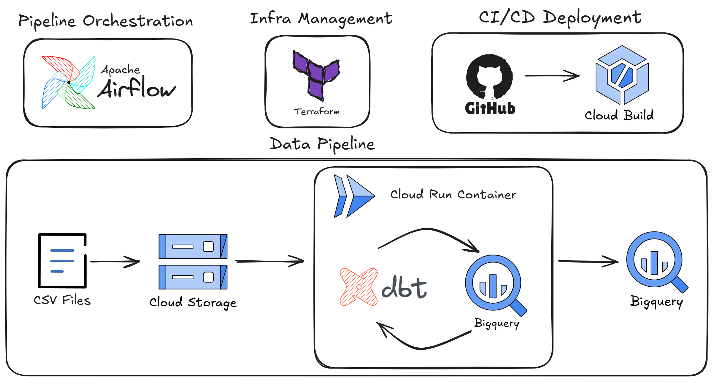
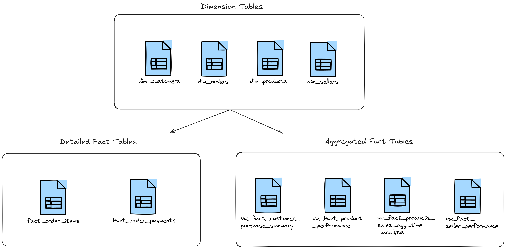
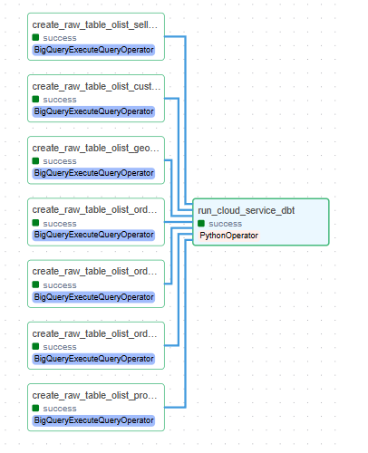

# Ecommerce Data Pipeline

## Overview


This project implements a modern data pipeline for processing ecommerce data, leveraging cloud-native technologies. The architecture consists of four main components:

1. **Pipeline Orchestration:** Apache Airflow manages workflow scheduling and dependencies between pipeline steps.

2. **Infrastructure Management:** Terraform provides infrastructure-as-code capabilities for consistent environment provisioning.

3. **CI/CD Deployment:** GitHub repositories integrate with Cloud Build to enable continuous integration and deployment pipelines.

4. **Data Pipeline:**
   - **Ingestion:** CSV files containing ecommerce data (orders, products, customers) are uploaded to Cloud Storage
   - **Processing:** Data is processed using dbt (data build tool) running in Cloud Run containers
   - **Storage & Analysis:** Processed data is stored in and analyzed with BigQuery for business intelligence and reporting


For a detailed explanation, check out my Medium post: [Medium Article](https://medium.com/@claudiofilho22/end-to-end-data-engineering-project-using-dbt-bigquery-cloud-run-eae10e0c7dc3)


## Project Folder Structure
```
├── airflow         # Folder with airflow components (docker yml, dags e etc)
├── datasets        # Datasets folder
├── cloud_run_dbt   # Scripts and yml deployment of Cloud Run
├── src             # Images, files utility for repo documentation
├── terraform       # Terraform configuration files
```

## **Tables Created:**
### Dimension Tables
These tables store descriptive attributes about business entities. Contains 4 tables:
- **dim_customers**: Stores customer information and attributes.
- **dim_orders**: Contains order metadata and attributes.
- **dim_products**: Holds product details and characteristics.
- **dim_sellers**: Contains seller information.

### Detailed Fact Tables
These tables store transaction-level data at the most granular level. They contain metrics and foreign keys to dimension tables, contains 2 tables:

- **fact_order_items**: Likely stores individual line items for each order.
- **fact_order_payments**: Records payment transactions related to orders.

### Aggregated Fact Tables
These tables contain pre-calculated aggregations and summaries. They're optimized for reporting and typically improve query performance, contains 4 tables:

- **vw_fact_customer_purchase_summary**: Aggregated view of customer purchasing behavior.
- **vw_fact_product_performance**: Performance metrics for products.
- **vw_fact_products_sales_agg_time_analysis**: Time-based aggregations of product sales.
- **vw_fact_seller_performance**: Performance metrics for sellers.

## **Data Model:**



## **Cloud Run Folder Tree Structure:**
```plaintext
cloud_run_dbt/
├── dbt/
│   ├── logs/
│   ├── models/
│   │   ├── marts/
│   │   ├── stg/
│   │   └── schema.yml
│   ├── target/
│   └── .gitignore
├── .user.yml
├── dbt_project.yml
├── profiles.yml
├── app.py
├── cloudbuild.yml
├── Dockerfile
└── requirements.txt
```

## GCP Configuration
### Required GCP Services
You must enable the following APIs in your Google Cloud project:
- **Cloud Build API** - Allows you to build container images in the cloud
- **Secret Manager API** - Provides secure storage for sensitive configuration values
- **Cloud Run Admin API** - Enables deployment and management of Cloud Run services
- **Artifact Registry API** - Securely stores and manages container images and artifacts in the cloud.

### Setting Up Repository Connection
You'll also need to connect your repository Github to Cloud Build (1st generation) for continuous integration.


## Terraform Configuration

This project uses Terraform to manage infrastructure on GCP. Below is an overview of the main files and their purposes:

- **`provider.tf`**: Defines the GCP provider and general configurations.  
- **`variables.tf`**: Declares variables used throughout the infrastructure.  
- **`iam_service_account.tf`**: Create service accounts and configures IAM policies and permissions.  
- **`gcs.tf`**: Provisions Cloud Storage buckets.  
- **`cloud_build.tf`**: Configures Cloud Build for automation CI/CD.  
- **`outputs.tf`**: Configures the generated by the terraform run.  


### Usage

1. **Initialize Terraform**  
   ```sh
   terraform init
   ```
2. **Validate configuration**  
   ```sh
   terraform validate
   ```
3. **Plan infrastructure changes**  
   ```sh
   terraform plan
   ```
4. **Apply changes**  
   ```sh
   terraform apply
   ```
5. **Generate the service account files in a JSON**  
   ```sh
   jq -r '.airflow_service_account_key_base64.value' outputs_tf.json | base64 --decode > ../airflow/keys/airflow_service_account.json
   ```

Optionally, to destroy resources:  
```sh
terraform destroy
```


## Apache Airflow Setup with Docker Compose

### Prerequisites
Ensure you have the following installed:
- [Docker](https://docs.docker.com/get-docker/)
- [Docker Compose](https://docs.docker.com/compose/install/)

### Installation Steps

1. **Go to the airflow folder to run your docker-compose**
   ```sh
   cd GCP/pipeline-ecommerce-bq-dbt/airflow
   ```

2. **Set the `AIRFLOW_UID` environment variable**
   Run the command below and place the output value in a `.env` file:
   ```sh
   echo -e "AIRFLOW_UID=$(id -u)" > .env
   ```

3. **Initialize Airflow** (only required for the first run)
   ```sh
   docker-compose up airflow-init
   ```

4. **Start Airflow**
   ```sh
   docker-compose up --build -d
   ```

### Stopping and Cleaning Up

To stop and remove all Airflow containers and volumes, run:
```sh
   docker-compose down
```

### Accessing the Airflow UI
Once Airflow is running, you can access the web interface at:
- **URL:** http://localhost:8080
- **Default Username:** `airflow`
- **Default Password:** `airflow`

### DAG
Below you can see the dag created by `airflow/dags/pipeline-ecommerce-bq-dbt.py` file:





## Author
Claudio César

[](https://www.linkedin.com/in/claudio-c%C3%A9sar-506961164/)


